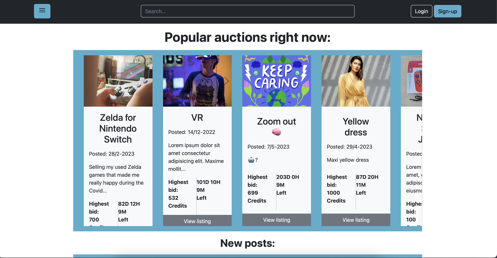

# Semester project 2

This site was my delivery for the second-year semester project at Noroff. The purpose of this project was to create an auction site using bootstrap and vanilla JavaScript. The site had to be responsive and get and post data to and from the Noroff API. 

## Description

The requirements for this project were as follows:

- A user with a "stud.noroff.no" email address should be able to register and log in to the site.
- A registered user can login and logout
- A registered user can update their avatar
- A registered user can view their total credit
- A registered user can create an auction
- A registered user can bid on other user's auctions
- A registered user can view bids made on an auction
- An unregistered user can search trough listings

## Built With

[BOOTSTRAP](https://getbootstrap.com/) 
[SCSS](https://sass-lang.com/) 
[JAVASCRIPT](https://developer.mozilla.org/en-US/docs/Web/JavaScript) 
[HTML](https://developer.mozilla.org/en-US/docs/Web/HTML) 

## Getting Started

Installing

This is where you list how to get the project started. It typically just includes telling a person to clone the repo and then to install the dependencies e.g.

Clone the repo:
git clone git@github.com:NoroffFEU/portfolio-1-example.git
Install the dependencies:
npm install
Running

Here is where you detail how to run the app. It typically involves the commands you'd need to run to start the project e.g.

To run the app, run the following commands:

npm run start
Contributing

Here you can detail any information you want to provide regarding contributing to the project. For big projects you will usually have a separate CONTRIBUTING.md and link to it, but for smaller projects you can simply include instructions here. These instructions can simply detail the process you want a person to take, such as to make sure to open a pull request so code can be reviewed.

Contact

This is where you can leave your social links for people to contact you, such as a LinkedIn profile or Twitter link e.g.

My Twitter page

My LinkedIn page

License

You can link to your license file here if you're using one, or mention what license the codebase falls under. If you're unsure then you can simply delete this section.

Acknowledgments

This is where you can add any acknowledgements if you'd like, such as to people who have helped you or any code snippets you'd like to mention. You can delete this section if you don't have any acknowledgements to make.
