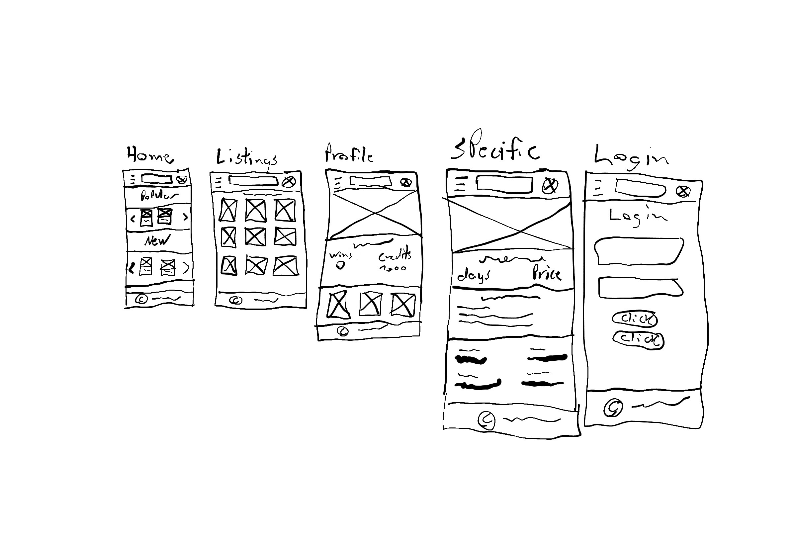

# semester-project-2
This repository contains my delivery for Semester project 2.

## How to run this repository:

- Open a new terminal
1. run: 
```
npm i
```
2. Then run:
```
npm run build
```
3. And to start a server to view it in a browser run:
```
npm run server
```


image: 



| Resource | Url |
|----------|-----|
| Repository | [Github](https://github.com/Zycrix/semester-project-2) |
